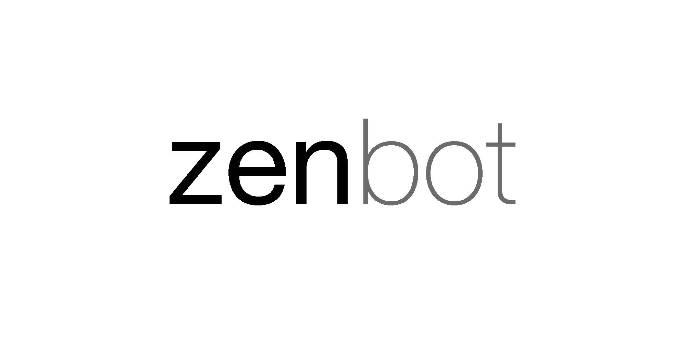

### Zenbot
Zenbot is an online _natural language processing_ (NLP) service and bot hosting.

It allows you to add natural language interface to any application, website or chat bot for widely used messengers like Facebook, Slack and Telegram.

You can find more about Zenbot in the [documentation](https://docs.zenbot.org).

### This repository
Here you can find samples of [Botscripts](https://docs.zenbot.org/botscript/).

### How to test
Fork this repository and select the sample Botscript file you wish to test.

Create your new bot through [Zenbot web console](https://zenbot.org) and upload this file.
Now you can test a newly created bot through a web console and see a bot\'s responses in JSON format.

**Note that in some of examples you have to provide some data in the Botscript before you can test the bot.**

You can also use [REST API](https://docs.zenbot.org/rest/) to test all these samples.

### Messengers
You can also test your bot right through the chat with it in [Facebook Messenger](https://docs.zenbot.org/messengers/facebook/), [Slack](https://docs.zenbot.org/messengers/slack/) or [Telegram](https://docs.zenbot.org/messengers/telegram/).
Just follow instructions in our [documentation](https://docs.zenbot.org) to integrate your bot with theses messengers.

### Need help?
Please post your questions in our [Google Group](https://groups.google.com/forum/#!forum/zenbot) if you have any questions or troubles with Zenbot.
You can also post any glitches you\'ve found.

If you have a question or have found some bugs in one of samples, just [post the issue here](https://github.com/uzyovoys/zenbot/issues).

### How to contribute
You can also take a part in Zenbot development by sharing your own Botscripts, [custom patterns](https://docs.zenbot.org/pattern/matching/) or [custom entities](https://docs.zenbot.org/pattern/entities/).

Just fork this repository and then post a pull request when you are ready to share your code.
